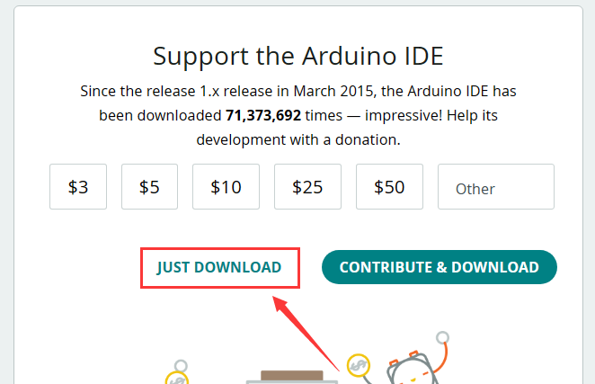
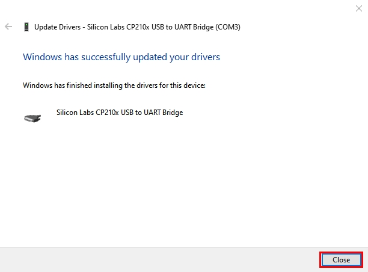
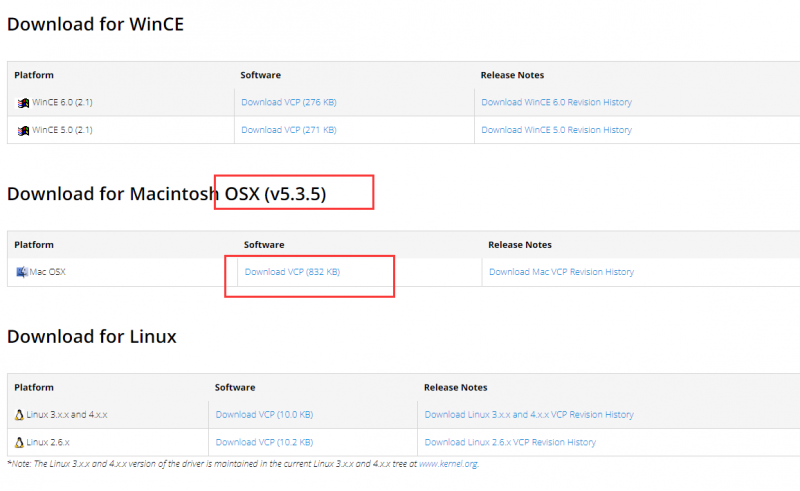
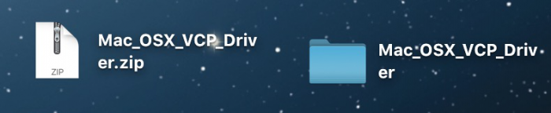
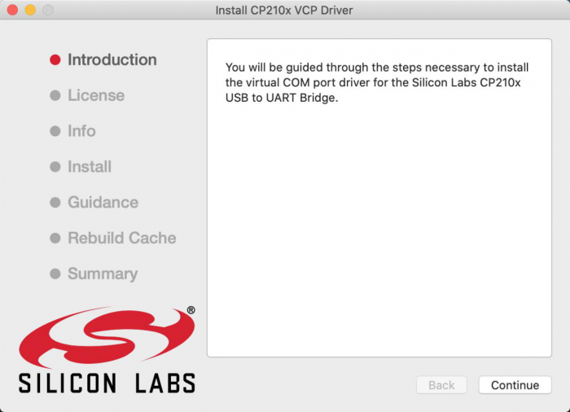
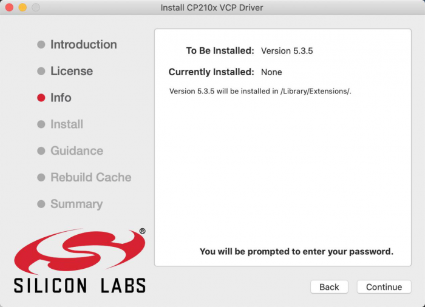

# **Keyestudio Mega2560 Plus Board**

##  **1.Description**

Keyestudio Mega 2560 plus Board, whose processor core is ATMEGA2560-16AU, is fully compatible with Arduino Mega 2560 REV3.

USB to TTL chip adopts more economic and stable CP2012.

This plus board consists of 54-channel digital input and output ports, of which 15 pins are served as PWM output, 16 analog inputs, 4 serial communication ports, one 16MHz crystal oscillator, 1 USB port, 1 power socket, 1 ICSP interface and 1 reset button.

##  **2.Specification**
-   Microcontroller: ATMEGA2560-16AU
-   USB to TTL chip：CP2102
-   Operating Voltage: 5V
-   Input Voltage (recommended):DC 7-12V
-   Digital I/O Pins: 54 (D0-D53)
-   PWM Digital I/O Pins：15(D2-D13 D44-D46)
-   Analog Input Pins: 16(A0-A15)
-   DC Current per I/O Pin: 20 mA
-   DC Current for 3.3V Pin: 50 mA
-   Flash Memory: 256 KB of which 8 KB used by bootloader
-   SRAM: 8 KB
-   EEPROM: 4 KB
-   Clock Speed: 16 MHz
-   LED_BUILTIN:D13

## **3.Interfaces**

## **4.Special Interfaces Description**

Serial communication interface(4 channel): Serial（D0 =RX0, D1 =TX0）, Serial1（D19 is RX1, D18 is TX1)

Serial2 （D17 is RX2, D16 equals to TX2）, Serial3（D15 is RX3, D14 is TX3), D0 and D1 are connected to ATMEGA16U2-MU

PWM port（Pulse width modulation): D2-D13 and D44-D46

External interrupt pins：D2（interrupt 0), D3(interrupt 1), D21（interrupt 2), D20 (interrupt 3), D19(interrupt 4）and D18（interrupt 5）

SPI communication interface：D53 stands for SS, D51 is MOSI, D50 is MISO, D52 equals to SCK

IIC communication interface：D20 represents SDA, D21 is SCL

## **5.Install Arduino IDE and Driver**

### 5.1 Download Arduino IDE

#### **A. Windows System**

You could download Arduino IDE from the official website: <https://www.arduino.cc/>

Enter the link and click **SOFTWARE**:

There are various versions of IDE for Arduino. Just download a version compatible with your system.

Here we will show you how to download and install the windows version of Arduino IDE.

There are two versions of IDE for WINDOWS system. You can choose between the installer (.exe) and the Zip file. For installer, it can be directly downloaded, without the need of installing it manually while for Zip package, you will need to install the driver manually.

You just need to click **JUST DOWNLOAD**.

#### **B. Mac System**

The versions of Arduino IDE vary from operation systems.

For how to download Arduino IDE on Mac, please refer to Windows:

After downloading, double-click to open it and follow the installation instructions.

#### **C.Detailed installation steps：**

1.Save the .exe file downloaded from the software page to your hard drive and simply run the file .

2.Read the License Agreement and agree it.

3.Choose the installation options.

4.Choose the install location.

5.Click finish and run Arduino IDE

### 5.2 Installing Driver

#### **A. Install Driver on Windows System**

Now, let’s install the driver of keyestudio MEGA PLUS control board. Its chip is CP2102 serial chip. Some system（**WIN11**） can’t install automatically driver but you could install it by hand.

**Download driver from:** [**https://fs.keyestudio.com/CP2102-WINDOWS**](https://fs.keyestudio.com/CP2102-WINDOWS)

**Or get dirvers from:**[**https://www.silabs.com/documents/public/software/CP210x_Universal_Windows_Driver.zip**](https://www.silabs.com/documents/public/software/CP210x_Universal_Windows_Driver.zip)

Click the link to download , and we unzip it to .

Unzip again and we will get the folder . Please remember the path of this folder for later use.

Right click Computer—– Properties—– Device Manager.

The yellow exclamation mark on the page implies an unsuccessful installation and you should double click , then click “**Update Drive…**”to update the driver.

Click “**Browse my computer for drivers**” to find the downloaded Arduino software.

There is a DRIVERS folder in Arduino software installed package, please open this folder and check the driver of CP210X series chips.

Click “Browse…”, then search the driver of CP2102 and click“Next”.

After a while, the driver is installed successfully.

When opening the device manager, we will find that the yellow exclamation mark disappears, which means the driver of CP2102 is installed successfully.

#### **B. Install Driver on MAC System**

Connect board we provide to your computer, and open Arduino IDE.

Click “Tools” to select **Board: Arduino 2560** and **Port: /dev/cu.usbserial-0001**.

Tap  to upload code, if burn successfully, you will view Done uploading.

Note: If burn unsuccessfully, you need to install driver of CP2102, please continue to follow the instructions as below:

Download the driver of CP2102:<https://www.silabs.com/developers/usb-to-uart-bridge-vcp-drivers?tab=downloads>

1. Select Mac OSX edition

2. Unzip the downloaded package

3. Open folder and double-click SiLabsUSBDriverDisk.dmg file.

4. You will view the following files as follows:

5. Double-click Install CP210x VCP Driver, tick Don’t warn me and tap Open.

6. Tap Continue

7. Tap Continue and Agree

8. Click Continue and input your password

9. Select Open Security Preferences

10. Click the lock to unlock security & privacy preference.

11. Then click Allow

12. Back to installation page, and wait to install.

13. Successfully installed

14. Then enter ArduinoIDE, click Tools and select Board: Arduino Uno and /dev/cu.SLAB_USBtoUAPT

15. Click to upload code and you will see “Done uploading”.

### 5.3 Arduino IDE Setting

Clickicon and open Arduino IDE.

To avoid the errors when uploading the program to the board, you need to select the correct Arduino board that matches the board connected to your computer.

Then come back to the Arduino software, you should click Tools→Board, select the board. (as shown below)

Then select the correct COM port (you can see the corresponding COM port after the driver is successfully installed)

### 5.4 Start Your First Program

Open file to choose Examples—>BASIC—>BLINK

Set board and COM port, the bottom right corner of the IDE displays the corresponding board and COM port.

Clickicon to start compiling the program, and check errors.

Clickicon to start upload the program, upload successfully.

The program is uploaded successfully, LED of board lights on for 1s, and lights off for 1s.
